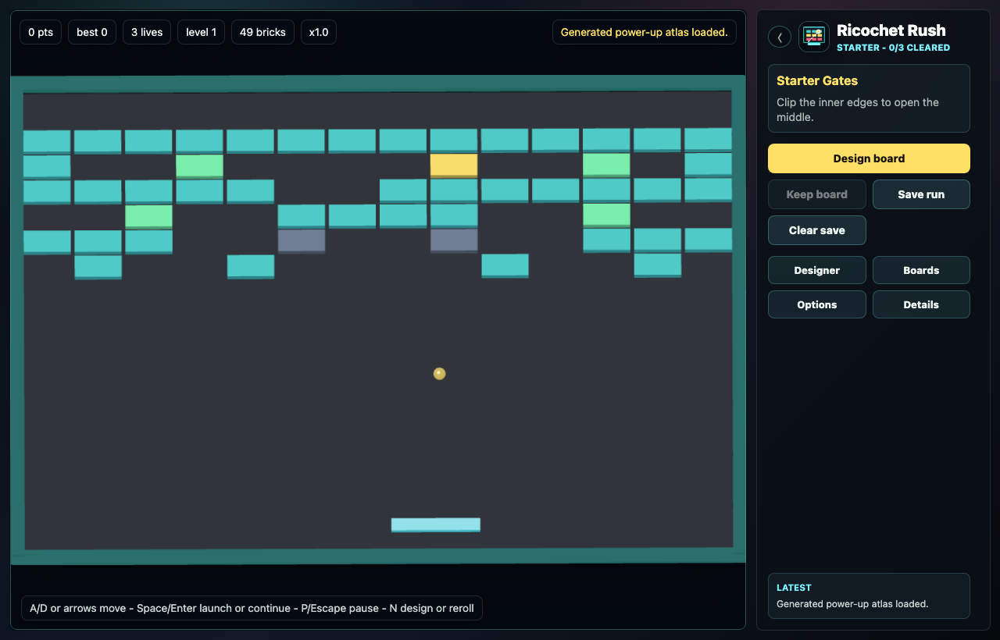

# Ricochet Rush

<p>
  
</p>

Ricochet Rush is a fast 3D browser brick-breaker with a sharp paddle, angled rebounds, lives, score, multiball, laser and grab paddles, bomb chains, boss bricks, and a power-up atlas.

The game includes curated board packs for repeatable runs, plus a prompt-first board designer for generated walls. Curated packs use a compact **14×9** grid; the board designer asks Cursor SDK `composer-2.5` in fast mode for a finer **20×12** canvas so icon and silhouette prompts (faces, logos, motifs) have enough resolution to read in 3D. The server validates composer output without rewriting the layout, then materializes it into the playable brick grid. If Cursor auth is missing or the SDK fails, the local fallback generator keeps the run playable.



<video src="docs/media/ricochet-rush-demo.webm" controls muted playsinline width="960" aria-label="Ricochet Rush gameplay and board designer demo"></video>

## Run

Requires Node.js 22.19.0 or newer and npm 11.16.0 (pinned by `packageManager`).

```sh
npm install
npm run dev
```

Open `http://127.0.0.1:4177`.

### Agent mode

Open `http://127.0.0.1:4177/?agentMode=1` to slow the whole game simulation for interactive agent play: ball movement, paddle movement, lasers, power-ups, timers, effects, and run logic all use the same slower game clock. This mode is meant for a human-watched headed browser session, such as telling a pi agent to start the server, open the URL with `agent_browser`, and play by observing the page and sending normal inputs. It does not start an outside autoplay script, and default agent mode leaves paddle control manual.

Agent mode also exposes `window.__ricochetRushGame` for the active browser session so agents can inspect the current state while they play. Add `&agentPaddle=auto` only when you explicitly want the in-game debug paddle assist to snap to the projected ball path by itself; that debug assist runs at normal game speed.

## Controls

- `A/D` or arrow keys: move paddle
- `Space` or `Enter`: launch, continue, or restart
- `P`: pause or resume
- `N`: design or reroll a generated board
- Pointer movement over the arena also moves the paddle

## Product Features

- 3D arcade board rendered with Three.js
- Authored board packs with unlock progress, preview cards, and best score by pack
- Board Designer prompt for requests like `heart shaped board with only exploding blocks`
- Cursor SDK level generation through the local Node API only
- Public generation summary with raw generation trace kept behind the Run Log
- Saved Designs pack for generated boards you decide to keep
- Local fallback levels for offline or unauthenticated play
- Autosaved run checkpoints, restore, Options-only clear-save confirmation, and best score
- Settings for SFX volume, music volume, particles, reduced motion, and high contrast
- Reward, hazard, and volatile power-up categories with readable pickup labels
- Pack/source board theme tints and original Ricochet Rush logo/icon assets
- Responsive desktop and mobile layout

## Verification

```sh
npm run ci
```

The CI gate builds the app, runs unit tests for level/save/pack/designer/power-up contracts, and runs a Playwright smoke against the production preview. The smoke verifies curated-pack boot, designer prompt persistence, fallback generation summaries, saved generated boards, board selection, paddle movement, autosave/clear behavior, settings persistence, canvas rendering, and layout overflow.

The CI gate also runs the automated UX audit. It drives desktop and mobile play, opens the main tool panels, checks WebGL pixel clarity, detects console errors, horizontal overflow, obvious text/control fit issues, playfield overlap, focus traps, and touch controls, then writes screenshots plus a Markdown/JSON report under `dist/playtest-report/`. Run `npm run ux` when you want the standalone visual/playability audit with a fresh build.

After a Playwright package update, run `npx playwright install chromium` once if the smoke reports a missing browser executable.

Set `CURSOR_API_KEY` in the shell or in local `.env` to enable live Cursor SDK level generation. Restart the dev or preview server after changing `.env`. Browser generation falls back locally if the full server retry budget is exhausted or the compact draft fails validation. Set `RICOCHET_RUSH_FORCE_FALLBACK=1` when deterministic fallback generation is desired.

To refresh the README demo clip after visual changes, run:

```sh
npm run capture:demo
```

## Demo And QA

- [Playtest checklist](docs/PLAYTEST_CHECKLIST.md)
- [Demo script](docs/DEMO_SCRIPT.md)
- [Known limitations](docs/KNOWN_LIMITATIONS.md)
- [Dependency policy](docs/DEPENDENCIES.md)
